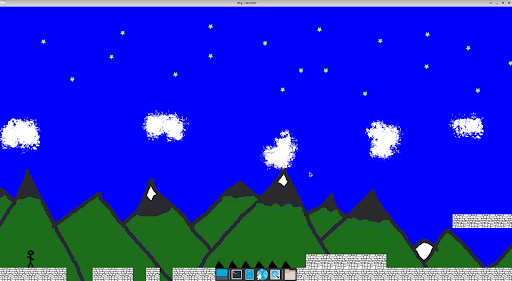

# B-MUL-100-TLS-1-1-myrunner-simon.vermeulen

Réalisation d'un jeu de type runner à l'aide de la CSFML.

Le jeu permet de prendre en charge plusieurs maps différentes fournies par l'utilisateur.  
Elles seront fournies sous forme de fichier qui seront parsés par le jeu avant d'être affichés.  

De plus un réel système de physique gère la gravité dans le jeu, permettant de gérer les chutes et saut de l'utilisateur.  

Afin de pouvoir modifier et stocker plus facilement les données et paramètres concernant le jeu, les données sont stockées dans des fichiers
JSON qui seront parsés par le jeu puis utilisées pour gérer la gravité, vie du personnage ou autres.  
Un système qui me permettra par la suite de réaliser des jeux plus poussés plus facilement.

